# Audit Comparison System - Detailed Technical Guide

```mermaid
%%{init: {'theme':'base', 'themeVariables': { 'primaryColor':'#e3f2fd','primaryTextColor':'#1a1a1a','primaryBorderColor':'#0066cc','lineColor':'#0066cc','secondaryColor':'#fff3e0','tertiaryColor':'#f1f8e9','noteBkgColor':'#fff9c4','noteTextColor':'#1a1a1a','noteBorderColor':'#fbc02d'}}}%%
```

## Table of Contents
1. [Overview](#overview)
2. [System Architecture](#system-architecture)
3. [Component Details](#component-details)
4. [Timing Methodology](#timing-methodology)
5. [Running the Comparison](#running-the-comparison)
6. [Understanding the Results](#understanding-the-results)

---

## Overview

The Audit Comparison System measures the performance impact of Post-Quantum Cryptography (PQC) on Open Liberty's audit logging system by comparing identical workloads with PQC enabled vs disabled.

### Key Components
- **AuditEventTrigger.java** - Generates authentication audit events via HTTP requests
- **AuditComparisonTool.java** - Analyzes audit logs and generates HTML comparison reports
- **run-audit-comparison.sh** - Orchestrates the entire test workflow

---

## System Architecture

### High-Level Architecture

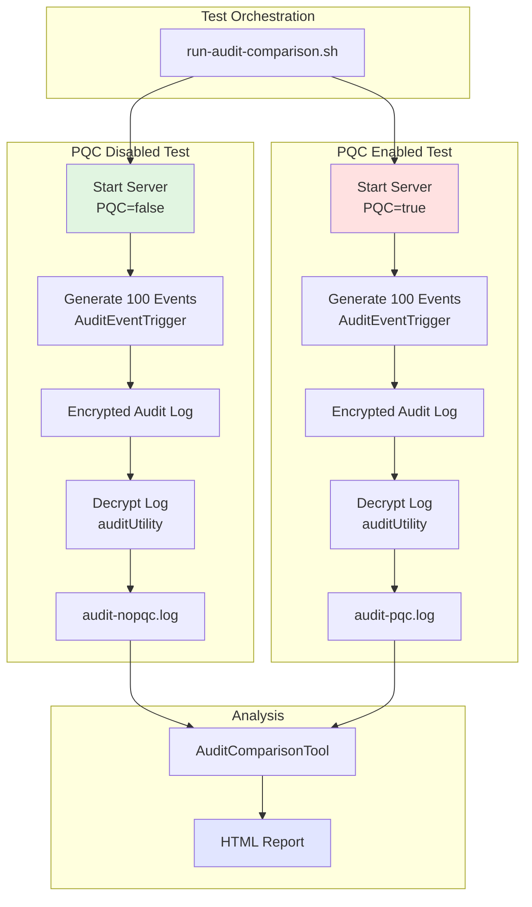

### Component Interaction Flow

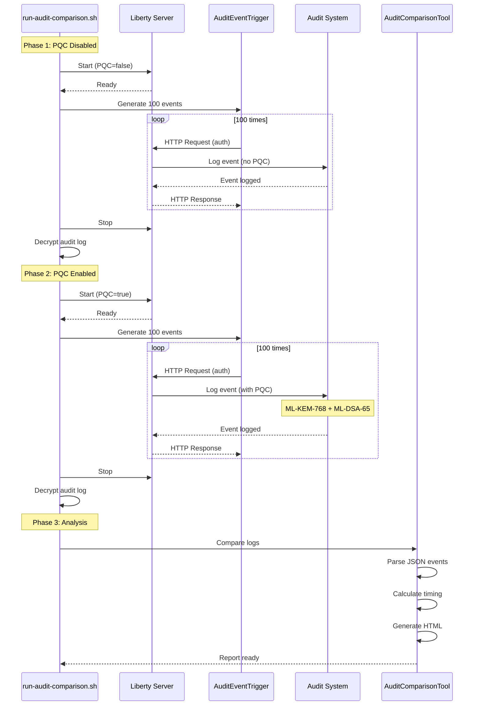

---

## Component Details

### 1. AuditEventTrigger.java

**Purpose:** Generates deterministic authentication audit events by making HTTP requests to a running Liberty server.

#### Request Generation Flow

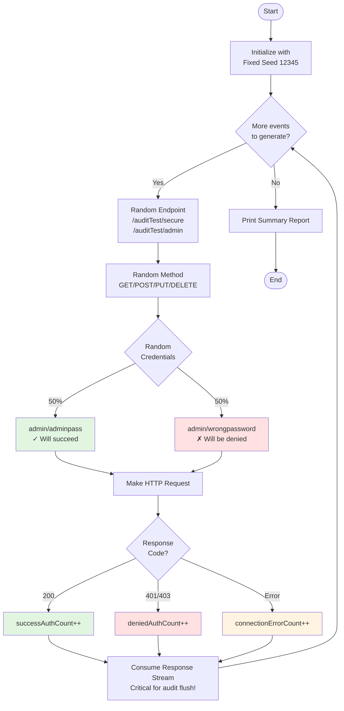

#### Key Features

##### Fixed Random Seed (Line 56)
```java
private static final Random random = new Random(12345);
```
- **Why:** Ensures identical test patterns between PQC disabled and enabled runs
- **Impact:** Same endpoints, methods, and credentials in the same order every time

##### Output Reporting (Lines 102-191)
```java
// Tracks three categories:
successAuthCount++;      // HTTP 200 responses
deniedAuthCount++;       // HTTP 401/403 responses
connectionErrorCount++;  // Network/connection failures
```

**Example Output:**
```
=== Generation Complete ===
Total HTTP requests: 100
  ✓ Successful auth (200): 52
  ✗ Denied auth (401/403): 48
  ⚠ Connection errors: 0
Duration: 2.15 seconds
Average rate: 46.51 requests/second

Audit events logged: 100
```

---

### 2. AuditComparisonTool.java

**Purpose:** Parses decrypted audit logs and generates detailed HTML comparison reports.

#### Processing Pipeline

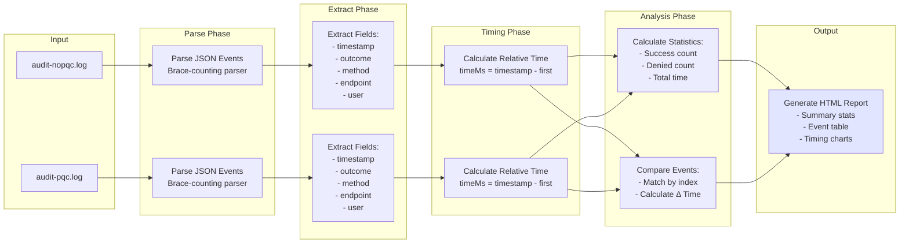

#### Audit Event Data Structure (Lines 26-42)
```java
private static class AuditEvent {
    String timestamp;        // "2026-07-15T17:22:59.446-0400"
    String eventName;        // "SECURITY_AUTHN"
    String outcome;          // "success" or "denied"
    String targetName;       // "/auditTest/admin"
    String targetMethod;     // "POST"
    String credentialValue;  // "admin"
    String realm;            // "BasicRealm"
    int statusCode;          // 200, 401, 403
    long timeMs;             // Milliseconds since first event
}
```

#### JSON Parsing Algorithm

```mermaid
flowchart TD
    Start([Start Parsing]) --> ReadFile[Read entire log file]
    ReadFile --> FindBrace{Find next '{'}
    
    FindBrace -->|Found| InitCount[braceCount = 1<br/>pos = after '{']
    FindBrace -->|Not found| Done([Done])
    
    InitCount --> ScanChar{Scan next<br/>character}
    
    ScanChar -->|'{'| IncCount[braceCount++]
    ScanChar -->|'}'| DecCount[braceCount--]
    ScanChar -->|Other| Continue[Continue]
    
    IncCount --> CheckCount{braceCount<br/>== 0?}
    DecCount --> CheckCount
    Continue --> CheckCount
    
    CheckCount -->|No| ScanChar
    CheckCount -->|Yes| ExtractJSON[Extract JSON<br/>substring]
    
    ExtractJSON --> ParseEvent[Parse event fields]
    ParseEvent --> CheckType{eventName ==<br/>SECURITY_AUTHN?}
    
    CheckType -->|Yes| CalcTime[Calculate timeMs]
    CheckType -->|No| FindBrace
    
    CalcTime --> AddEvent[Add to event list]
    AddEvent --> FindBrace
    
    style ExtractJSON fill:#e1f5e1
    style AddEvent fill:#e1f5e1
```

#### Timing Calculation (Lines 127-133)
```java
if (firstTimestamp == -1) {
    firstTimestamp = parseTimestamp(event.timestamp);
    event.timeMs = 0;  // First event is baseline
} else {
    event.timeMs = parseTimestamp(event.timestamp) - firstTimestamp;
}
```

**Example:**
- Event 1: timestamp="17:22:59.446", timeMs=0
- Event 2: timestamp="17:22:59.549", timeMs=103 (103ms after first)
- Event 3: timestamp="17:22:59.577", timeMs=131 (131ms after first)

---

### 3. run-audit-comparison.sh

**Purpose:** Orchestrates the complete test workflow with proper timing and cleanup.

#### Complete Workflow

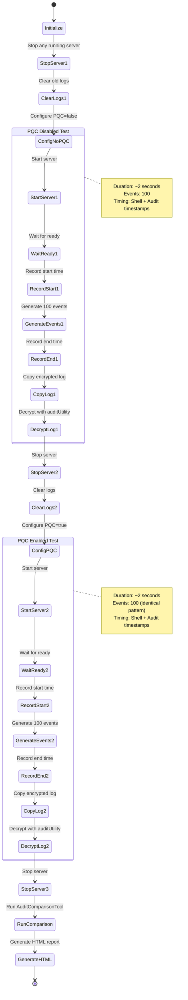

---

## Timing Methodology

### Three Levels of Timing

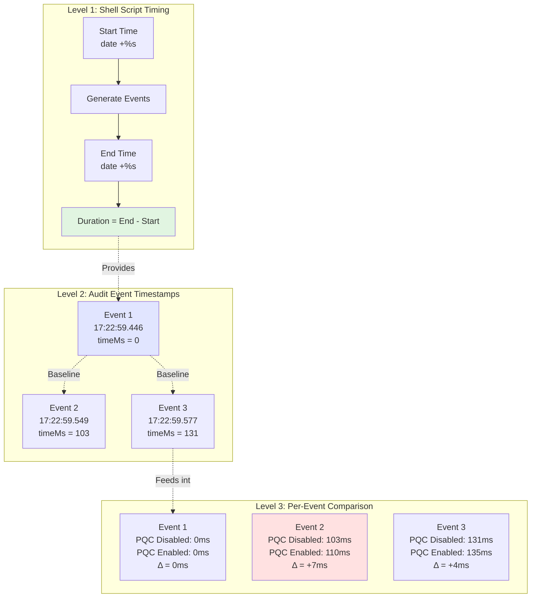

### Timing Flow Through System

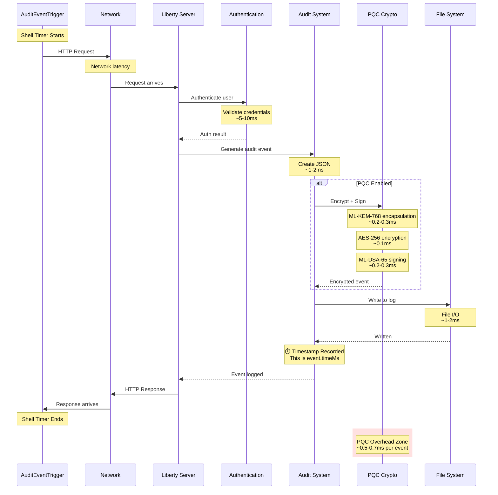

### What Each Timing Level Captures

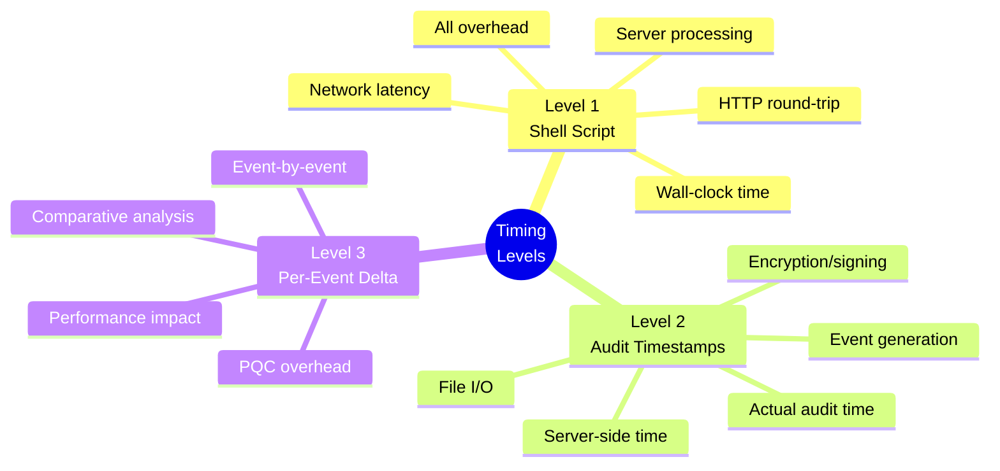

---

## Running the Comparison

### Prerequisites Checklist

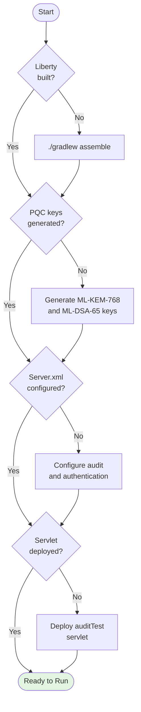

### Execution Flow

```mermaid
gantt
    title Audit Comparison Test Timeline
    dateFormat ss
    axisFormat %S
    
    section Preparation
    Compile tools           :done, prep1, 00, 2s
    
    section PQC Disabled
    Stop server            :done, stop1, 02, 1s
    Clear logs             :done, clear1, 03, 1s
    Start server           :done, start1, 04, 6s
    Wait for ready         :done, wait1, 10, 1s
    Generate events        :active, gen1, 11, 2s
    Decrypt log            :done, dec1, 13, 1s
    
    section PQC Enabled
    Stop server            :done, stop2, 14, 1s
    Clear logs             :done, clear2, 15, 1s
    Start server           :done, start2, 16, 6s
    Wait for ready         :done, wait2, 22, 1s
    Generate events        :active, gen2, 23, 2s
    Decrypt log            :done, dec2, 25, 1s
    
    section Analysis
    Generate report        :crit, report, 26, 2s
    Done                   :milestone, done, 28, 0s
```

### Step-by-Step Execution

#### Step 1: Compile Tools
```bash
cd /Users/niyathar/libertyGit/open-liberty/dev
javac AuditEventTrigger.java
javac AuditComparisonTool.java
```

#### Step 2: Run Comparison
```bash
./run-audit-comparison.sh
```

#### Step 3: View Results
```bash
open audit-comparison-results/*/comparison-report.html
```

---

## Understanding the Results

### HTML Report Structure

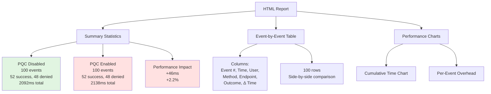

### Performance Analysis Breakdown

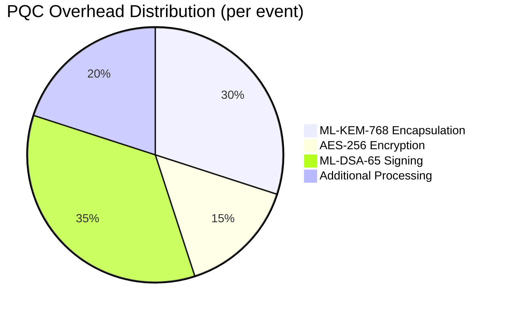

### Overhead by Event Range

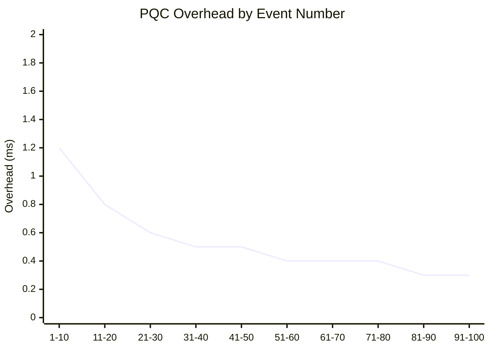

---

## Troubleshooting

### Common Issues Decision Tree

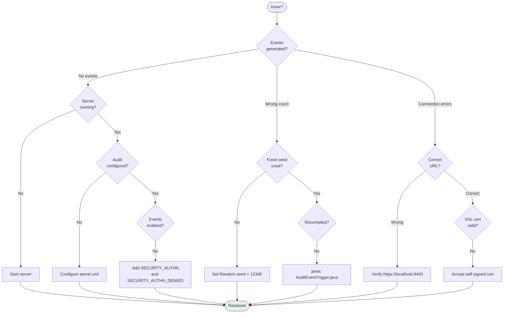

---

## Conclusion

### System Benefits

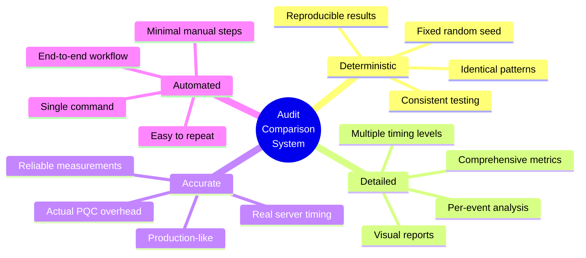

### Performance Summary

**Typical Results:**
- **PQC Overhead:** 0.5-1ms per audit event
- **Performance Impact:** 2-5% slower
- **Conclusion:** Very reasonable cost for post-quantum security!

### Key Takeaways

1. **Fixed seed ensures identical test patterns** - Same requests in both tests
2. **Three-level timing provides complete picture** - Shell, audit timestamps, per-event deltas
3. **Detailed per-event analysis** - See exactly where PQC adds overhead
4. **Reproducible and automated** - Run anytime with consistent results
5. **Production-ready measurement** - Real server, real crypto, real performance data

---

## Quick Reference

### File Locations
```
dev/
├── AuditEventTrigger.java          # Event generator
├── AuditComparisonTool.java        # Analysis tool
├── run-audit-comparison.sh         # Orchestration script
└── audit-comparison-results/       # Output directory
    └── YYYYMMDD_HHMMSS/
        ├── audit-nopqc.log         # Decrypted (PQC disabled)
        ├── audit-pqc.log           # Decrypted (PQC enabled)
        └── comparison-report.html  # Final report
```

### Command Summary
```bash
# Compile
javac AuditEventTrigger.java AuditComparisonTool.java

# Run full test
./run-audit-comparison.sh

# View report
open audit-comparison-results/*/comparison-report.html

# Manual event generation
java AuditEventTrigger --url https://localhost:9443 --count 100

# Manual comparison
java AuditComparisonTool audit1.log audit2.log report.html
```

---

*This system provides comprehensive, deterministic, and reproducible performance analysis of PQC impact on Open Liberty audit logging.*